
</head>
<body class="style6" style="background-color: #808080">
<h1 class="auto-style3">&nbsp;SK6812 four languages word clock</h1>

With this clock the time can be displayed as text in the languages ​​Dutch, 
French, English and German. This clock was the ultimate challenge to make 
with its predecessor a single language word clock and Fibonacci clocks. The 
software to control the clock is written for Arduino with a minimum memory of 
48K such as the cheap Arduino Nano Every. In addition to controlling the 
correct time, there are many options that can be set in the program. For 
example, a single language for a clock with 144 (12x12) LEDs, various membrane 
keypads, a rotary, digital displays, a DCF77 atomic time receiver, Bluetooth 
connection to a mobile phone, and support for SK6812 and other LED strips.

&nbsp;

<table>
  <tr><td><a href="4LanguageClock/IMG_5557.JPG">
	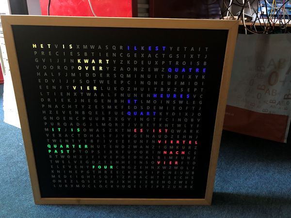</a></td><td>
	<a href="4LanguageClock/IMG_5560.JPG">
	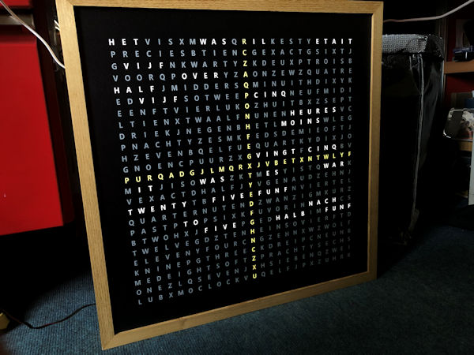</a></td>
</tr><tr><td>
		
 
		
&nbsp;

		
The four-language word clock uses 625 SK6812 RGBW LED strips. RGBW 
		LED strips have a white LED in addition to the red, green and blue LED. 
		This makes it possible to make the letters light up bright white. The 
		colors are also sparkling with these SK6812 LEDs. The library used to 
		drive the LEDs also supports the use of many types of other LEDs. 
		  SK6812 LEDs each contain a small processor, which means that the 
		entire chain of LEDs can be controlled with one wire.

  </td><td>

			<a href="4LanguageClock/4-talenklok_IMG_1176.jpg">
			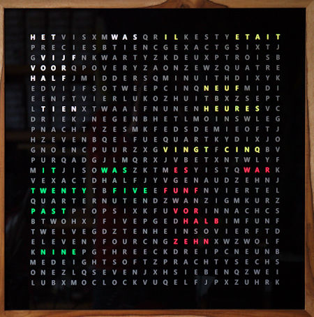</a>
</td></tr></table>

&nbsp;&lt;- <a href="../index.html">Start page </a> 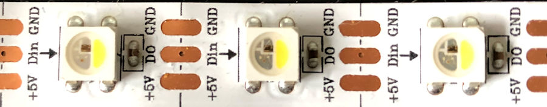 
 
The color word clock consists of the parts as shown in the table below. 
You can order the electronics and PCB from me. I do not have the case and word 
plate in stock. Having a word plate made will cost 300 to 500 euros. JPGs of 
two designs below.

 <strong>Accessories</strong> 
<table cellspacing="0">
  <tr>
    <td class="xl67" width="277">1 x case for 50x50 cm word plate </td>
    <td class="xl74" width="136">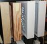 </td>
  </tr>
  <tr>
    <td class="xl70">1 x word plate  
      JPG-file with: 
      <a href="4LanguageClock/Viertalen-AlleLetters-23okt2018_50x50cm.jpg">All 625 characters</a> 
	       
          <a href="4LanguageClock/Viertalen-23okt2018_50x50cm.jpg">With a cross</a></td>
    <td class="xl75"> <a href="4LanguageClock/Viertalen-AlleLetters-23okt2018_50x50cm.jpg">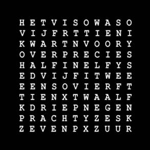</a> </td>
  </tr>
  <tr>
    <td class="xl71">1 x Spacerplaat, foamed PVC wit 10 MM RAL 9003</td>
    <td class="xl76"> </td>
  </tr>
  <tr>
    <td class="xl70">1 x PCB SK6812-klok </td>
    <td class="xl75">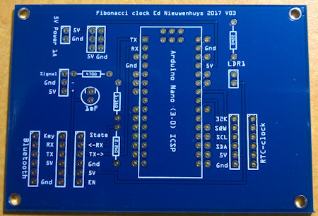 </td>
  </tr>
  <tr>
    <td class="xl70">1 x 1000 µF capacitor </td>
    <td class="xl75">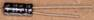 </td>
  </tr>
  <tr>
    <td class="xl70">1 x 1.1kΩ resistor </td>
    <td class="xl75">&nbsp; </td>
  </tr>
  <tr>
    <td class="xl70">1 x 2.2kΩ resistor </td>
    <td class="xl75">&nbsp; </td>
  </tr>
  <tr>
    <td class="xl70">1 x 470kΩ resistor (1-3 needed) </td>
    <td class="xl75">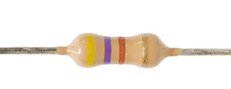 </td>
  </tr>
  <tr>
    <td class="xl70">1 x LED red </td>
    <td class="xl75">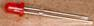 </td>
  </tr>
  <tr>
    <td class="xl70">1 x LED yellow </td>
    <td class="xl75">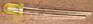 </td>
  </tr>
  <tr>
    <td class="xl70">1 x 2-pin female connector </td>
    <td class="xl75">&nbsp; </td>
  </tr>
  <tr>
    <td class="xl70">1 x 3-pin female connector </td>
    <td class="xl75">&nbsp; </td>
  </tr>
  <tr>
    <td class="xl70">1 x 5-pin female connector </td>
    <td class="xl75">&nbsp; </td>
  </tr>
  <tr>
    <td class="xl70">2 x 6-pin female connector </td>
    <td class="xl75">&nbsp; </td>
  </tr>
  <tr>
    <td class="xl70">2 x 15-pin female connector </td>
    <td class="xl75">&nbsp; </td>
  </tr>
  <tr>
    <td class="xl70">1 x Arduino Nano Every </td>
    <td class="xl75">&nbsp; </td>
  </tr>
  <tr>
    <td class="xl70">1 x SK6812 LED-strip 625 LEDs </td>
    <td class="xl75">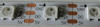 </td>
  </tr>
  <tr>
    <td class="xl67">1 x&nbsp; KY-040 Keyes Rotary Encoder </td>
    <td class="xl74">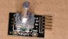 </td>
  </tr>
  <tr>
    <td class="xl70">1 x 4x3 membrane keypad </td>
    <td class="xl75">
      
&nbsp;

      
&nbsp;

      
&nbsp;
</td>
  </tr>
  <tr>
    <td class="xl70">1 x RCT DS3231 clock module  
      ZS-042 </td>
    <td class="xl75">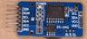 </td>
  </tr>
  <tr>
    <td class="xl70">1 x CR 2032 3V lithium battery </td>
    <td class="xl75"> </td>
  </tr>
  <tr>
    <td class="xl70">1 x light sensor </td>
    <td class="xl75">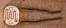 </td>
  </tr>
  <tr>
    <td class="xl71">1 x 22kΩ resistor </td>
    <td class="xl76">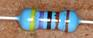 </td>
  </tr>
  <tr>
    <td class="xl70">1 x Adapter 5V DC, &gt;2 Ampere </td>
    <td class="xl75"> </td>
  </tr>
  <tr>
    <td class="xl67">1 x Verlichtingsgrondplaat 3 x 300 x 300 mm MDF-plaat </td>
    <td class="xl74">&nbsp; </td>
  </tr>
  <tr>
    <td class="xl70">1 x Adapter 5V DC, &gt;2 Ampere </td>
    <td class="xl91"> </td>
  </tr>
  <tr>
    <td class="xl67">Wireless Serial 6 Pin Bluetooth RF Transceiver Module HM10 (voor Iphone, IPad) </td>
    <td class="xl74">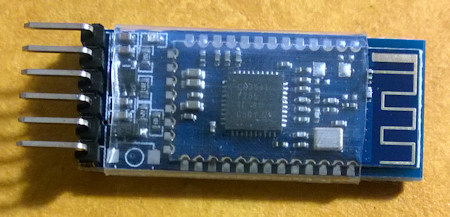 </td>
  </tr>
</table>

<strong> 
    Assembling the lighting base plate  
   
  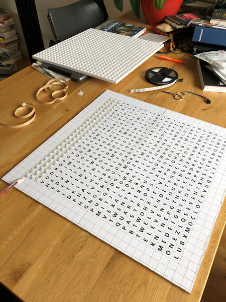 
</strong> 

The distance between the LEDs on the strip is suitable to make a clock of 50 
x 50 cm (60 LEDs/m). You can choose to stick the 625 LEDs of the clock in 25 
rows with 25 LEDs or only LEDs behind the letters that should light up. The 
latter method has the advantage that fewer LEDs are needed and that you have to 
drill fewer holes in the spacer plate. But .. there are many more soldering 
points, each of which can cause malfunctions. The software also has a digital 
time mode mode that you can only use if you install all 625 LEDs.  You can also 
choose to cut out the illuminated words in a 1 cm thick MDF board with a jigsaw. 
Paint the insides white otherwise the white light will become dingy. Stick 
the strips from left to right on the odd lines and from right to left on the 
even lines. Follow the arrows on the strip. 

Apply solder to the LED strip terminal and later solder the wire in the 
solder blob. A reasonable amount of current (1A) will flow at full 
load. If you are going to connect all the strips in succession, a lot of current 
will flow at the first LEDs and the wire must be thick. I make a connection 
per two lines from the power wire with 30AWG = 0.25mm diameter. 30AWG wire 
can tolerate 0.9A current or not insulated tinned copper wire of 0.6mm on one 
side of the strips the 5V connection and on the other side the earth connection. 
Finally, make sure that each strip has its power. The spacer plate will be 
placed on the front, on top of the LEDs, and it must lie flat on the surface to 
prevent light leakage.

<table><tr><td>
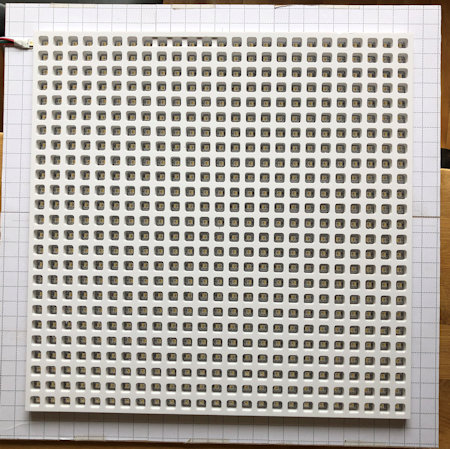 </td>
<td>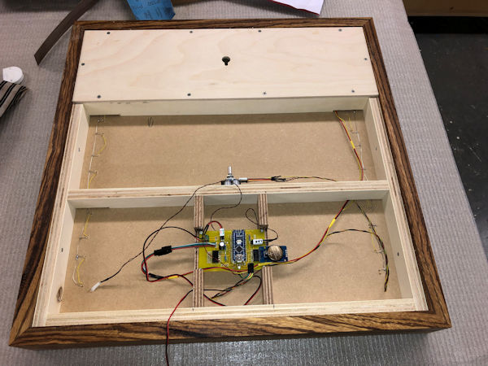</td> 
</tr><tr><td class="auto-style3">spacer plate</td><td class="auto-style3">
		Back side</td></tr></table> 

In the signal wire between LED_PIN 5 (D5) of the Arduino and the SK6812 LED 
connection Di is a 470 Ohm resistor. A 1 mF (1000 uF) capacitor is placed 
across the GND and 5V to the LED strip to dampen the turn-on voltage. The 
LEDs do work without these two components (onrush preventer) but can be damaged. 
The onrush preventer schedule is below. You can connect all components 
directly to the pins of the Arduino Nano without the printed circuit board. 
There is also a PCB to which everything can be soldered. This printed circuit 
board can also be used for the <a href="https://github.com/ednieuw/Fibonacciclock">Fibonacci clock</a>. 

At the bottom of this page 
the latest PCB version with more connections.

<table><tr><td></td>
<td></td>
</tr><tr><td colspan="2">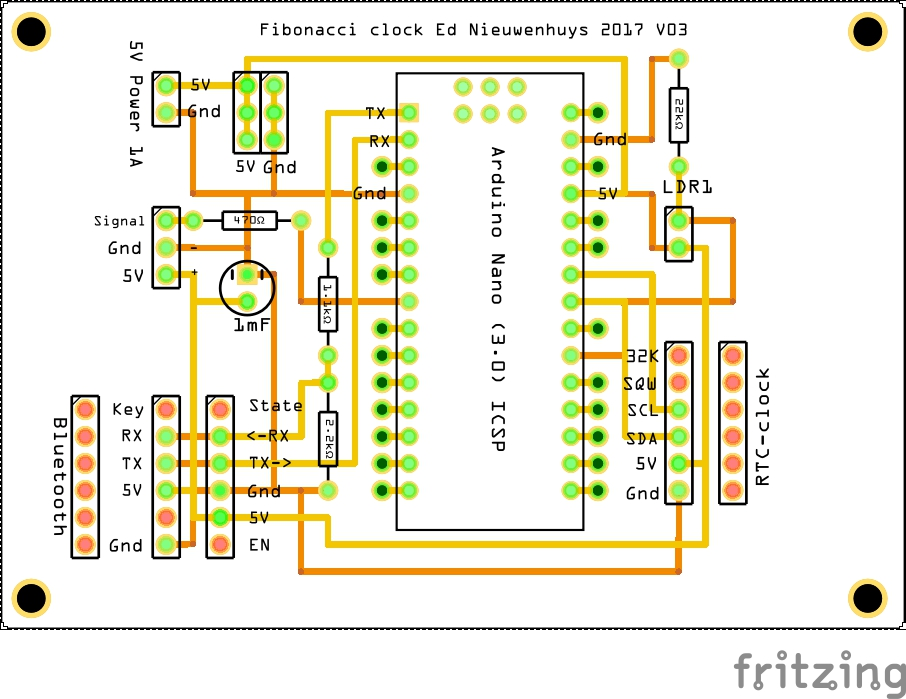 </td></tr><tr><td colspan="2">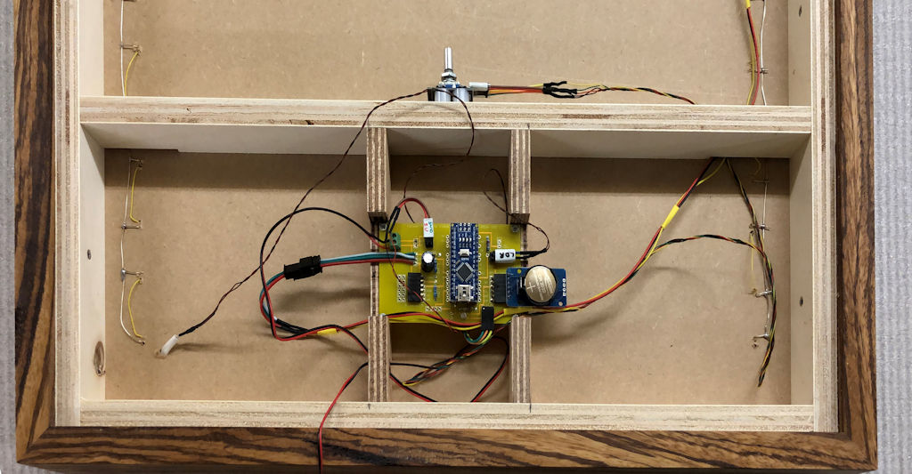</td>
</tr><tr><td class="auto-style3">
	Connections in the case</td><td class="auto-style3">&nbsp;
	</td></tr></table> // digitale port connections on Arduino&nbsp; D2 - D13 
	
<pre>enum DigitalPinAssignments {      // Digital hardware constants ATMEGA 328 ----
 RX           = 0,                // Connects to Bluetooth TX
 TX           = 1,                // Connects to Bluetooth RX
 DCF_PIN      = 2,                // DCFPulse on interrupt  pin
 encoderPinA  = 3,                // right (labeled DT on decoder)on interrupt  pin
 clearButton  = 4,                // switch (labeled SW on decoder)
 LED_PIN      = 5,                // Pin to control colour SK6812/WS2812 LEDs
 BT_TX        = 6,                // Connects to Bluetooth RX
 BT_RX        = 7,                // Connects to Bluetooth TX
 HC_12TX      = 6,                // HC-12 TX Pin  // note RX and TX are reversed compared with a BT Module
 HC_12RX      = 7,                // HC-12 RX Pin 
 encoderPinB  = 8,                // left (labeled CLK on decoder)no interrupt pin  
 secondsPin   = 9,
 HeartbeatLED = 10,               // PIN10        = 10,                        // PIN 10 
 DCFgood      = 11,               // DCF-signal &gt; 50    //PIN11        = 11,   // PIN 11
 PIN12        = 12,               // PIN 12             // led = 12,          // MKR1010
 DCF_LED_Pin  = 13,               // DCF signal
 };
 
enum AnaloguePinAssignments {     // Analogue hardware constants ----
 EmptyA0      = 0,                // Empty
 EmptyA1      = 1,                // Empty
 PhotoCellPin = 2,                // LDR pin
 EmptyA3      = 3,                // Empty
 SDA_pin      = 4,                // SDA pin
 SCL_pin      = 5,                // SCL pin
 EmptyA6     =  6,                // Empty
 EmptyA7     =  7};               // Empty</pre>
&nbsp;
<strong>Assembling the clock</strong> 
 It is convenient to tape the clock parts with paper masking tape. This 
adhesive tape comes off easily. Stick the lighting plate and spacer together. 
Stick a white sheet of paper over the spacer. Paper gives a nice drawing to the 
illuminated letters. Place the word plate over the paper and fix it with 
adhesive tape as well. With a hardwood clock, depending on the version, the 
word plate is slid into the slot in the cabinet. Then assemble the fourth, 
bottom part of the cabinet. Glue this or stick it temporarily with adhesive 
tape. If everything is labeled correctly, the clock, rotary encoder, LDR, 
power supply can be connected. Assemble the cabinet.

  

<strong>Bluetooth connection</strong>  A Bluetooth connection to the clock can be made 
with the HC05 or HM-10 Bluetooth module. The HC05 only communicates with 
Android. The HM-10 communicates with both Android and Apple IOS. The link 
below describes to which pins the module is connected and how the name of the 
module is changed. With a Bluetooth terminal app on the phone, the time can 
be sent to the clock as hhmmss or hhmm. The clock sends data back to the 
terminal app every minute. Bluetooth terminal apps are available for Windows 
phone, Android and 
<a href="https://apps.apple.com/tt/app/bleserial-hm-10/id1602239700#?platform=iphone">
IPhone</a>. The Bluetooth terminal programs are also available 
for PCs. The Bluetooth module communicates between RX (read) and TX 
(transmit) at 3.3V. It is possible to connect it directly to the Arduino 
ports but it will extend the life of the module if the voltage is lowered to 
3.3V. This can be done with a 3.3V-5V TTL Level Logic Level Converter module, 
or with a voltage divider circuit with resistors as shown below. You can also 
mount the resistors in the wiring from the module to the printed circuit board.

  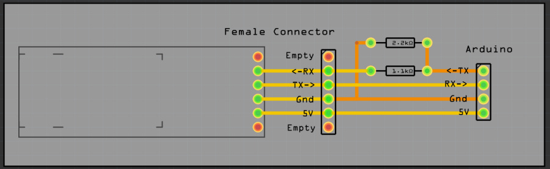 
 

<strong>Bluetooth with the HM10 BLE for Android and Apple IOS</strong> 
With this HM10 BLE module you can communicate with Apple IOS and Android. After that, commands can be sent 
with a serial terminal program (<a href="https://apps.apple.com/tt/app/bleserial-hm-10/id1602239700#?platform=iphone">BLEserial HM-10 for IOS 
</a>or for Android BLE 
scanner from Blue Pixel Technologies) and the clock output can be collected. 
 Linked via an FTDI, AT commands can be given with the Arduino serial monitor 
with the Bluetooth module. See previous section for AT commands 
AT+NAMEnewname gives the module the name: newname

<a href="https://ednieuw.home.xs4all.nl/BLESerial/BLESerialUsage.html">More info about Bluetooth 
communication on this page</a>

 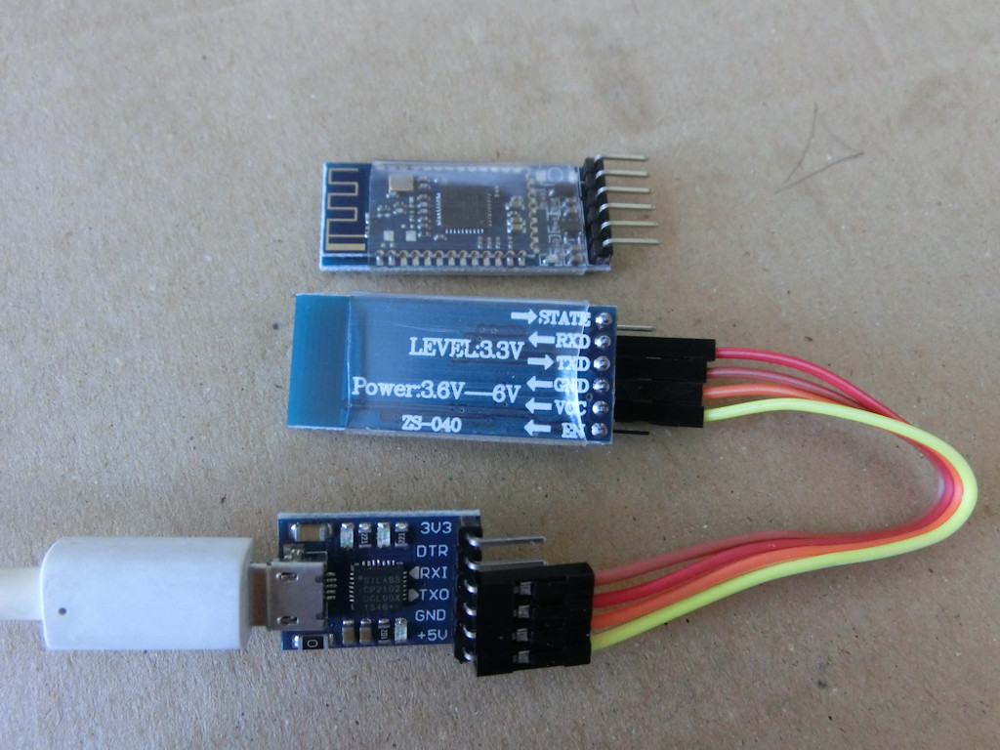 
 <strong>DCF77-ontvangst met DCF-2 module </strong>  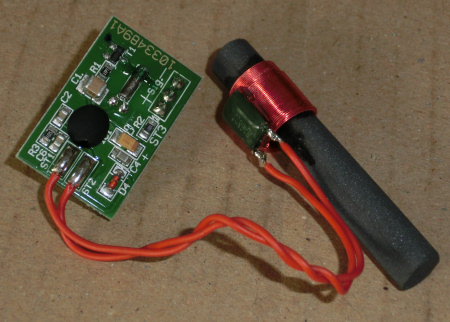 

Unfortunately, the ICs in the color LEDs interfere with DCF reception. With 
the SK6812 LEDs the interference seems less than with WS2812 color LEDs. With 
these color LEDs, the DCF receiver module must be mounted 10 cm or more from the 
LEDs. The latest software versions V058 and above combine two reception 
methods; the Arduino standard DCF77 library and an interrupt free method 
written by me. I have combined them in the software, which increases 
efficiency by more than 50% in the event of poor reception. Of the 44,000 
minute receptions, with the ferrite rod hanging 7cm from WS2812 color LEDs, 
13,000 were properly processed to a time and date by the DCF77 library and 
22,000 by the interrupt-free routine. This DCF77 module has three 
connections; +, - and signal. Connect the + to 5V and the - to GND. Signal 
goes to pin 2. NB Pin 2 was used for the rotary encoderPinB left (labeled CLK 
on decoder). This is now connected to P8. (Pin 2 is an interrupt pin. For 
optimal DCF reception, responding to an interrupt is not necessary for the 
rotary encoder. Look in the source of the version of the software under "PIN 
Assigments" for the correct connection.

 <a href="https://ednieuw.home.xs4all.nl/Woordklok/DCF77/DCF77_Arduino.html">Here some 
background information DCF</a>

&nbsp;

<a href="Libraries-needed-for-ColourClock.zip">Libraries needed</a> 
in this zip-file the needed libraries. 

<strong>Software </strong>

The libraries used can be found in the Arduino IDE. If that is no longer 
the case, the urls to the library have been put below

<pre>
#include "RTClib.h"              // https://github.com/adafruit/RTClib 
#include &lt;TimeLib.h&gt;             // For time management 
#include &lt;Adafruit_NeoPixel.h&gt;   // https://github.com/adafruit/Adafruit_NeoPixel 
#include &lt;SoftwareSerial.h&gt;      // For Bluetooth
#include &lt;Encoder.h&gt;             // http://www.pjrc.com/teensy/td_libs_Encoder.html                      
#include "DCF77.h"               // http://playground.arduino.cc/Code/DCF77 </pre>

<strong>PCB V14</strong> The latest PCB versions
 
<a href="WoordklokSK6812_files/Colour%20Word%20Clock%20PCBV14.fzz">V14</a>
&nbsp;of the PCB have fixed connections for the most commonly used parts. 
It is now possible to choose whether the serial connection to the Bluetooth 
module is via the standard connections 0 and 1, TX and RX, or whether it goes 
through terminals D6 and D7. In the current version, D6 and D7 are used for 
the Bluetooth module and the pads at D6 and D7 must be soldered closed. The 
signal wire in V14 to the LEDs has been moved relative to V13 so that the 
position of the connections corresponds to the LED strip.

 &nbsp;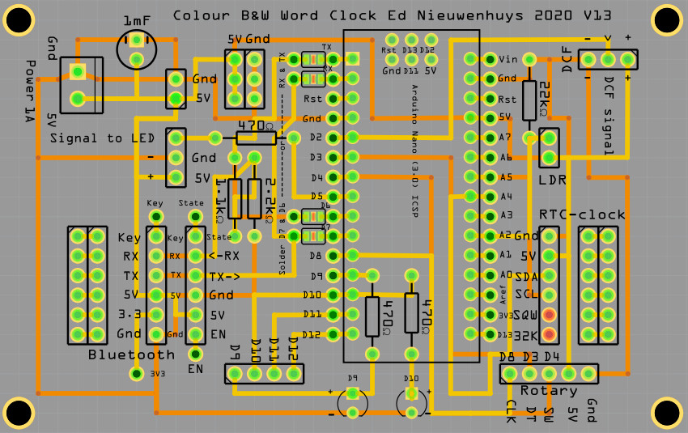 
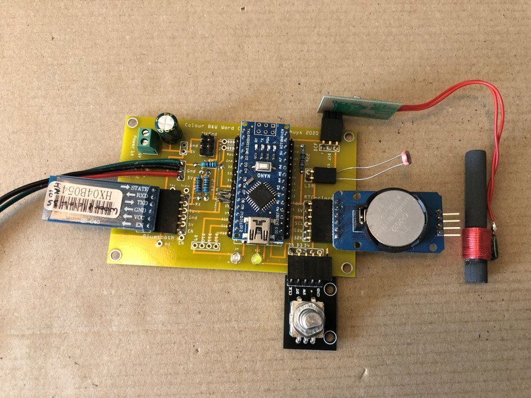 
 

